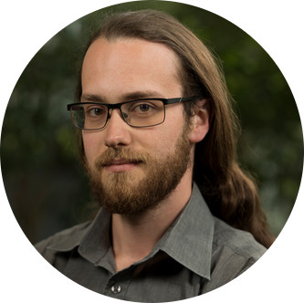

# About me

## Current position
### Professeur Agrégé at ICOM
[valentin.lachand-pascal@univ-lyon2.fr](mailto:valentin.lachand-pascal@univ-lyon2.fr)

## Former positions
### Research Engineer at LIRIS
### Technology teacher
### PhD Student at LIRIS

## Research area
Learning activities are increasingly breaking disciplinary boundaries, and unfold in a variety of contexts: in the classroom, at home, in libraries, etc. They are also increasingly digitally mediated. However most tools used are application-centric, structure documents and resources in silos, are designed for a given device and context of use. My research focuses on proposing activity-centric approach to facilitate the orchestration of learning activities inside and outside of the classroom.

